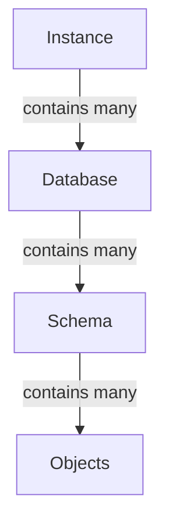
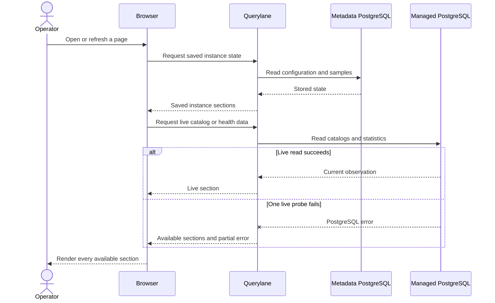

Querylane keeps its own application state separate from the PostgreSQL servers you ask it to inspect. That boundary prevents the setup database from being confused with customer data.

## Resource model

| Term | Meaning |
| --- | --- |
| Querylane metadata database | Querylane's internal PostgreSQL database for configuration, connection records, sampled metrics, and application state |
| Instance | A user-managed PostgreSQL server connection identified by host, port, and credentials |
| Database | A PostgreSQL database inside an instance, such as `app`, `analytics`, or `postgres` |
| Schema | A namespace inside a database, such as `public` or `pg_catalog` |
| Object | A table, view, routine, sequence, type, collation, foreign server, policy, trigger, and other catalog resource |

A Querylane installation can hold many instances. Each instance can expose many databases, and each database owns its schemas and objects.

Read the hierarchy from top to bottom:

1. An **instance** tells Querylane how to reach one PostgreSQL server.
2. That server exposes one or more **databases**.
3. Each database contains **schemas** that divide its namespace.
4. Schemas own the **objects** that Querylane lets you inspect.

## Stored configuration and live observations

Querylane combines 2 kinds of information:

- **Stored configuration** includes the connection record, labels, sampled metrics, and Querylane's own state.
- **Live observations** come from the managed server's PostgreSQL catalogs and statistics views when you open or refresh a page.

Follow one page load from top to bottom. The browser first asks Querylane for saved state, then requests the live sections needed by the page. Querylane reads its metadata database for the first kind and the managed server for the second. A failed live probe changes only the affected section; it does not erase the saved instance.

That distinction matters during failures. Querylane can still know an instance exists while showing its live health or catalog as unavailable. Partial errors stay attached to the affected section instead of making the whole server disappear.

## Connection ownership

Instances can be **API-managed** through the browser or **configuration-managed** through YAML. API-managed credentials are stored in Querylane's metadata database and should be encrypted with a stable `QUERYLANE_INSTANCE_SECRET_KEY`. Configuration-managed secrets can be read from environment variables and are not written back to YAML.

## Read-first behavior

The current product concentrates on catalog discovery, row inspection, activity, metrics, and access analysis. It does not yet expose a broad mutation surface. This makes its current boundary easy to understand, but it does not remove the need for least-privilege PostgreSQL roles, network policy, backups, or review of the queries operators run.
